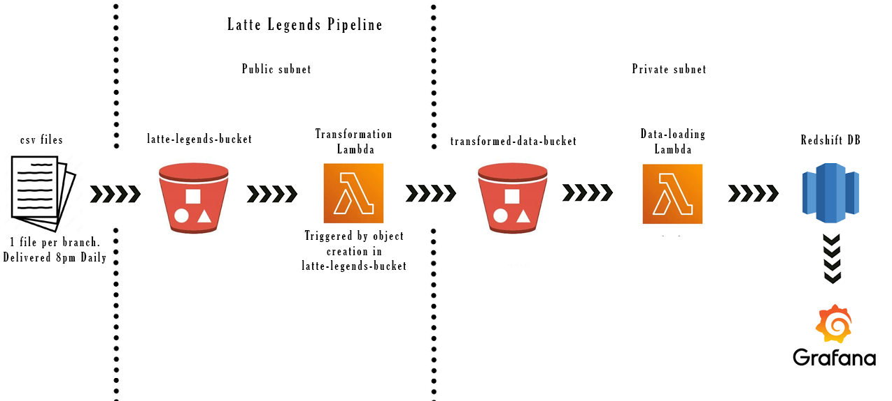
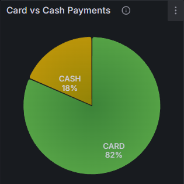

# latte-legends
## About:

This is a program designed and built to process data collected as csv files from branches of the Super Cafe. The program provides insightful visualisations of business data. The program protects customer privacy, automates data normalisation, and provides valuable reports and visualisations such as sales by product, product type and sales by branch. Decision makers can then answer questions such as:
* How many coffees did we sell, of which type, each week?
* Which store had the highest sales each week, or day?
* What was the total value of Hazelnut Coffee sales each week, totalled for all stores?
* What was the total value of Large Latte sales each day, totalled for all stores?

## Features
* Data Anonymization: Removes customer names and credit card numbers from the CSV files
* Transaction Normalisation: Splits combined product orders into separate entries for each item
* Data Preparation: Structures the data to facilitate reporting and visualisation of product sales across different categories (e.g., coffee type, size, etc.)

## Benefits:
* Enables generation of reports and visualisations for sales analysis
* Provides insights into product performance (e.g., popular items, sales trends)
* Supports data-driven decision making for product offerings and marketing strategies

## Pipeline Diagram

Here is a diagram of our data pipeline:

## Grafana Visualizations

### Card vs Cash Payment methods?

## Running the program
1. Run data_ingestion.py to load csv data into the program
2. Run data_cleaning.py to remove card info, name and clean the data
3. Ensure that docker app is running
4. Execute the following command 'docker-compose up -d' to spool up our docker container
5. Run sql_utils.py to create the latte_legends database and the tables
6. Run data_storage to load the cleaned data from the csv into the latte_legends database